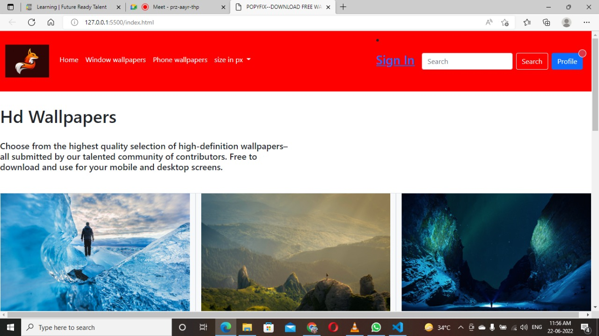
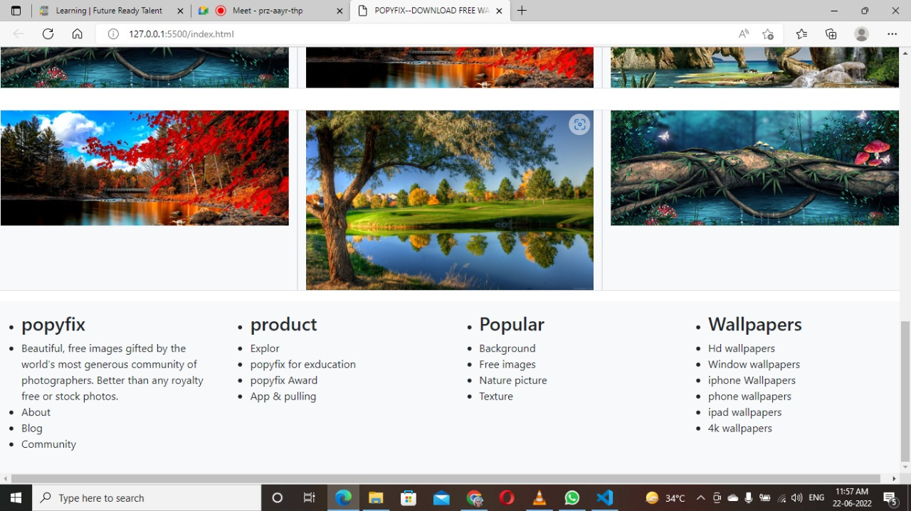
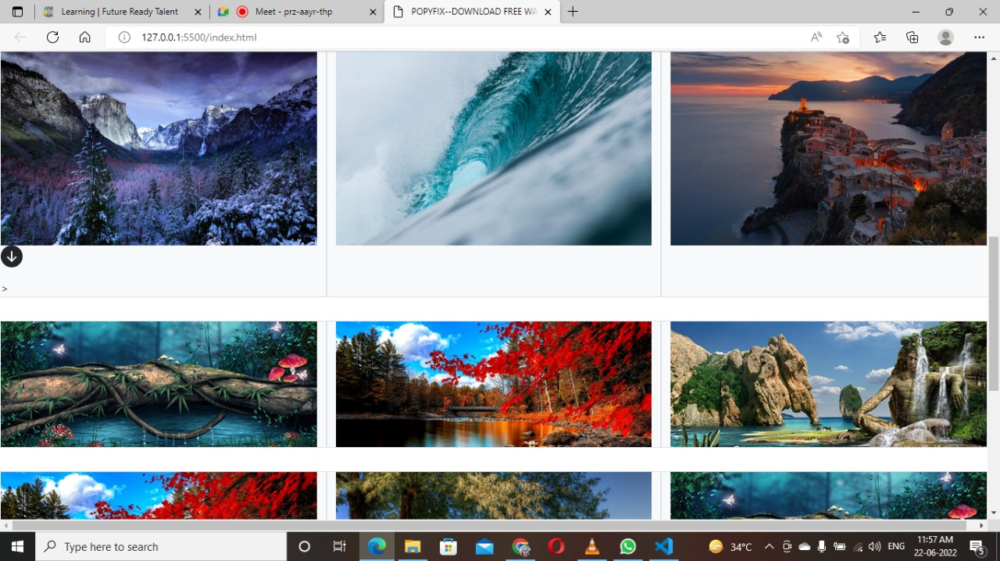
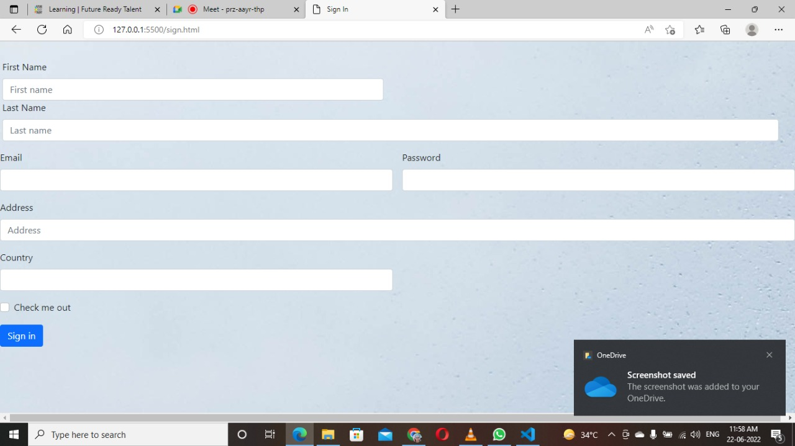

# ✨ Game Robo Website  ✨

This is a web based application developed for user to download wallpaper.

### This web based wallpaper download platform has been developed for the accomplishment of Future Ready Talent Internship program launched by Microsoft, Future Skills Prime, Quess, Github and EY.

**Project Link** - https://agreeable-ground-0578f2f10.1.azurestaticapps.net

**Demo Video** -  https://drive.google.com/file/d/1Y2KX5wBVAnxUETwREa1ZZNZfdRFWazPl/view?usp=sharing

## Features and Functionalities 😃

- Interactive and responsive UI.
- Has many graphical and visual innovative effects.
- Have an aesthetically pleasing visual design and architecture.
- User is able to download free wallpaper very easily through the website.

## Screenshots 📸
### Home  -   

### Middle  -   

### Last  -   

### Sign In  -   

## Tech Stack 💻

- [Azure(Hosting)](https://azure.microsoft.com/en-in/features/azure-portal/)
- HTML
- CSS
- JavaScript
- Bootstrap
